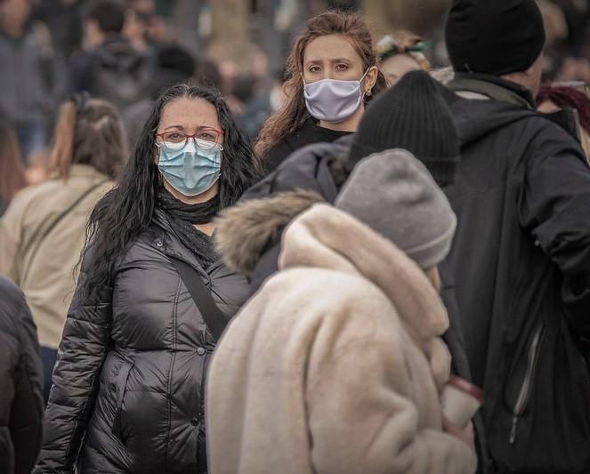
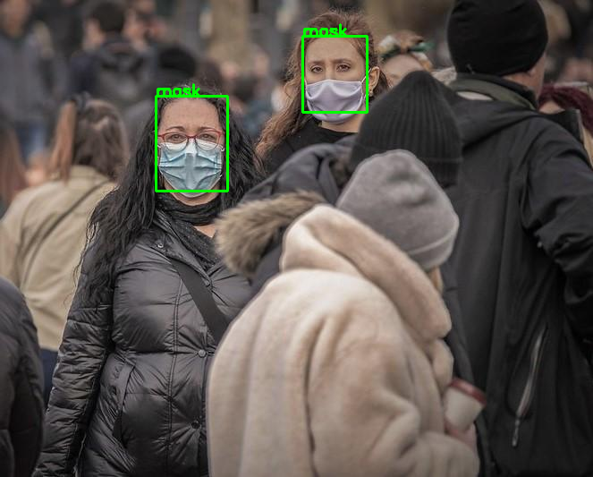
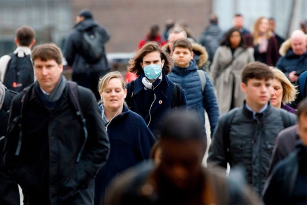
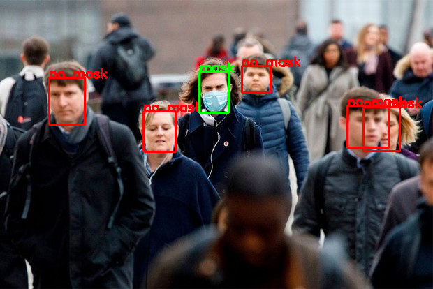
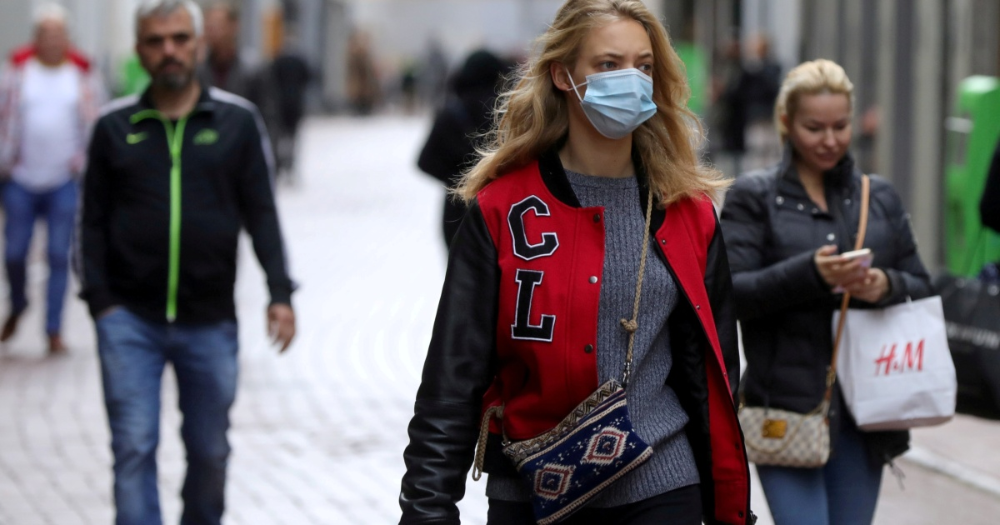
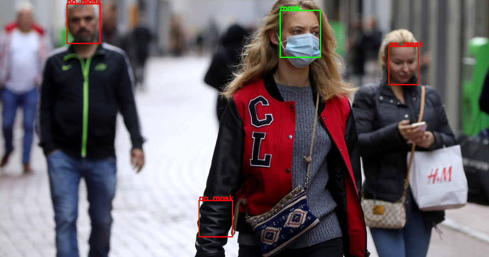

## Mask_Detector

Identifies faces and whether they are wearing masks in an image

### SET UP
Clone the repository

```git clone https://github.com/ArshKA/Mask_Detector.git```

Unzip the detector model

### USING

Create a detector object
```
from main import MaskDetector
detector = MaskDetector(model_path=current_directory)
```

Pass image through detector

```marked_image = detector.detect(image_path, save=True, face_confidence=.2)```

An output.png file will be created in the file's directory

### RESULTS

Image                     |Predicted
:-------------------------:|:-------------------------:
 | 
 | 
 | 
